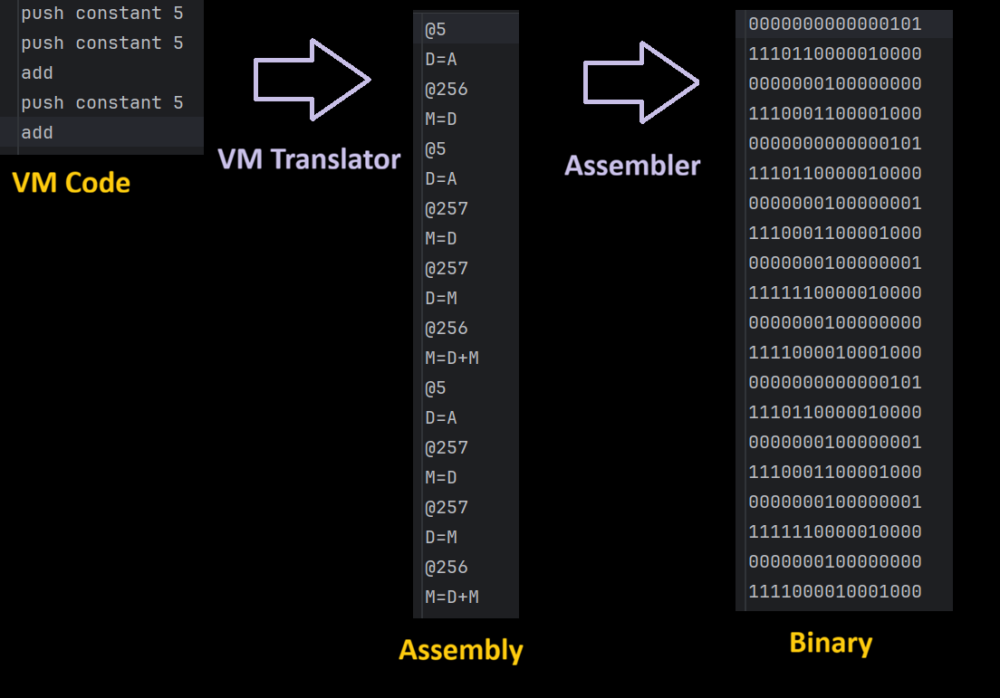

# Overview
This repository contains software tools that make up the translation pipeline from high-level code down to machine code, which is executable on a 16-bit computer

The process follows these stages:

High-level language → VM code → Assembly → Binary

- A compiler translates high-level code into VM instructions
- The VM Translator converts VM instructions into assembly
- The Assembler converts assembly into binary machine code executable on the 16-bit computer

## Example 
- Below is visual example of what each stage of the code looks like
- This is a program that performs the calculation "5 x 3" 

---

# VM Translator
The VM Translator is responsible for converting virtual machine (VM) code into assembly.

- The VM language serves as an intermediate representation, similar in concept to Java bytecode
- Input: VM code (generated by the compiler)
- Output: assembly code

### Features
- Arithmetic and logical operation commands
- Memory access commands (push/pop)
- Program flow commands (label, goto, if-goto)
- Function calling commands (call, function, return)

---

# Assembler
The Assembler translates assembly language into binary machine code.

- Input: assembly code
- Output: 16-bit binary instructions executable on the 16-bit computer

### Features
- Symbol resolution (labels and variables)
- translation of **A-instructions** (instructions that involve memory access and storing of constant values) and **C-instructions** (instructions that specify computations)

---

## ⚠️ Project Status
This project is currently a work in progress. Refer to the below feature list for status overview.

# Feature List

- ✅ **Assembler**

- ✅ **VM Translator**

- 🚧 **Compiler**
  - In progress

- ❗ **Operating System**
  - Not started
